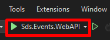
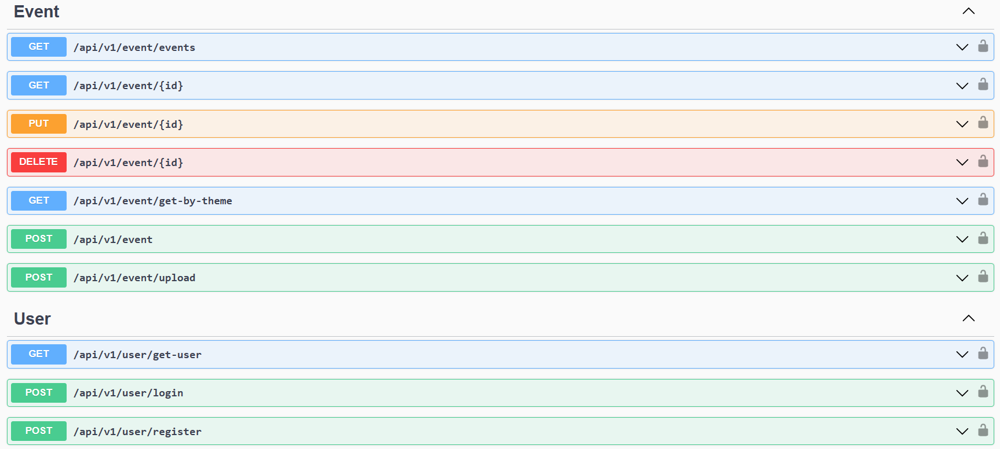

# Sds.Events (Gerenciamento de Eventos)

Este projeto é uma WebAPI em .NET Core 6.0 para gerenciais e administrar eventos, palestrantes, lotes de eventos e usuários.

## Índice

- [Sobre](#sobre)
- [Pré-requisitos](#pré-requisitos)
- [Configuração do Ambiente de Desenvolvimento](#configuração-do-ambiente-de-desenvolvimento)
- [Como Iniciar o Projeto](#como-iniciar-o-projeto)
- [Endpoints da API](#endpoints-da-api)
- [Testes](#testes)
- [Contribuição](#contribuição)
- [Licença](#licença)

## Sobre

Este projeto consiste em uma WebAPI desenvolvida em .NET Core 6.0, projetada para facilitar a administração e gestão de eventos. A aplicação oferece funcionalidades abrangentes para o gerenciamento de eventos, palestrantes, lotes de eventos e usuários.

Dentro do projeto contém um diretório com o projeto front-end em Angular para poder rodar e testar a api.

## Pré-requisitos

- .NET 6.0
- Node.JS
- Angular CLI
- VSCode
- Visual Studio
- SQL Server E SQL Management Studio, ou um gerenciador de banco de sua preferência

## Configuração do Ambiente de Desenvolvimento

- Clone o projeto na máquina local;
- Abra a solução "Sds.Events.sln" no Visual Studio;
- Abra o diretório do projeto angular Sds.Events/Sds.Events.UI no VS Code:
- Abra terminal (CTRL+SHIFT+'), instale as dependências do projeto angular executando `npm install` dentro do diretório Sds.Events/Sds.Events.UI

## Como Iniciar o Projeto

Explique como iniciar o projeto localmente. Inclua instruções sobre como restaurar pacotes, aplicar migrações, e iniciar o servidor.

- No visual Studio:
    - Abra o arquivo appSettings.Development.json e configure o banco de dados de sua preferência;
    - Clique em executar ou pressione F5. O banco de dados e as tabelas serão criadas automaticamente;
    
    

```bash
# Iniciar projeto angular (terminal)
ng serve ou ng s

```

## Endpoints da API

Acesse os endpoints através do navegador ou usando algum client HTTP como Postman, Insomnia etc.

Acesse os endpoints através desta url: http://localhost:5000/



## Contribuição

Contribuições são bem-vindas! Sinta-se à vontade para abrir problemas, enviar solicitações de pull e participar do desenvolvimento deste projeto. Consulte o [CONTRIBUTING.md](CONTRIBUTING.md#como-contribuir)
 para obter orientações sobre como contribuir.
